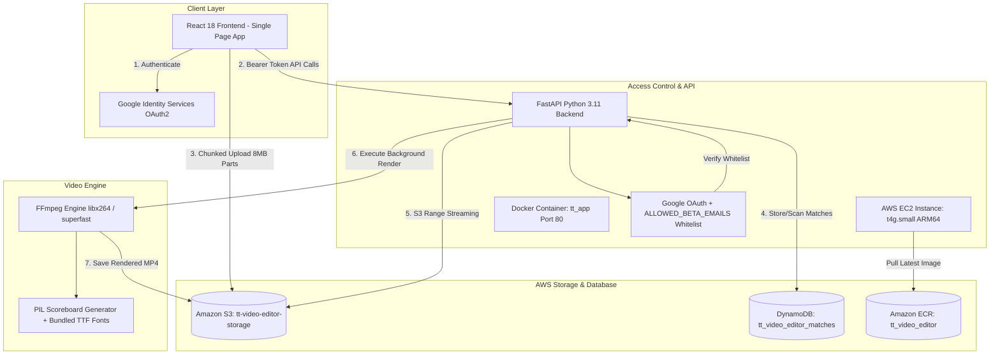
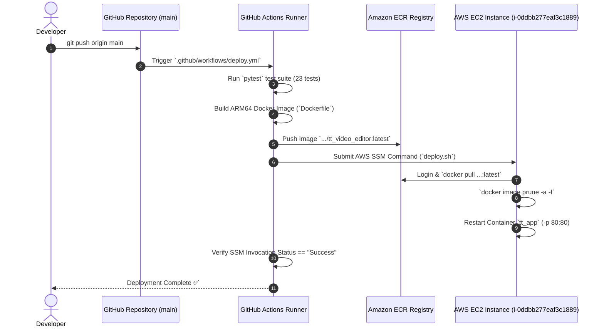

# System Architecture Document

## 1. Executive Summary & Purpose

The **Table Tennis Video Editor** is a web application for table tennis players and coaches. It automates video match scoring, rally highlight clipping, and custom high-definition scoreboard overlay rendering.

The application is deployed on a **single AWS EC2 instance** backed by **Amazon S3** for media storage, **Amazon DynamoDB** for match metadata, **Amazon ECR** for container deployment, and **Google OAuth + Email Whitelist** for cost protection and beta authorization.

---

## 2. System Architecture Topology

---

## 3. Component Deep Dive

### 3.1 Frontend (`frontend/`)
- **Technology**: React 18, TypeScript, Vite, Vanilla CSS.
- **Key Components**:
  - **`DashboardView`**: Upload match videos, create match records, view match cards.
  - **`WorkspaceView`**: Interactive rally tagging video player, score event logger, 2.5s live polling render status loop.
  - **`RenderHistory`**: List rendered video outputs with live status badges and execution duration pills (e.g. `⚡ 14.2s`).
  - **`GoogleLoginModal`**: Modal gating unauthenticated or unwhitelisted visitors.

### 3.2 Backend API (`app/`)
- **Technology**: Python 3.11, FastAPI, Uvicorn, Pydantic v2.
- **Key Modules**:
  - **`app/main.py`**: REST API endpoints for matches, video uploads, render jobs, and authorization.
  - **`app/auth.py`**: Verifies Google OAuth ID tokens and enforces `ALLOWED_BETA_EMAILS` whitelist checks.
  - **`app/render_adapter.py`**: Background worker triggering FFmpeg highlight rendering, tracking start/end execution timestamps, and platform-aware encoder selection (`libx264` on Linux EC2 vs `h264_videotoolbox` on macOS).
  - **`app/database.py`**: Polymorphic repository supporting `DynamoDBRepository` (production) and `SQLiteRepository` (local dev).
  - **`app/storage.py`**: Polymorphic storage engine supporting `S3StorageProvider` (production range-streaming & direct multipart) and `LocalStorageProvider` (local dev).

### 3.3 Scoreboard & Video Processing Engine (`src/tt_video_editor/`)
- **Core Processing**:
  - **`ScoreboardGenerator`**: Renders custom high-definition 1080p table tennis score overlays.
  - **Bundled Fonts (`src/tt_video_editor/fonts/`)**: Includes `Scoreboard-Bold.ttf` and `Scoreboard-Regular.ttf` to guarantee 1080p typography rendering across Linux EC2 and macOS.
- **Direct S3 Range Streaming**:
  - Bypasses full local file downloads by streaming S3 byte ranges directly into FFmpeg pipelines via presigned URLs.

---

## 4. Cloud Infrastructure & Cost Model

| Service | Environment / Resource | Purpose | Monthly Cost |
| :--- | :--- | :--- | :--- |
| **AWS EC2** | `t4g.small` (ARM64 Graviton2) | Live application server running Docker container `tt_app` on Port 80 | ~$12.26/mo |
| **Amazon S3** | `tt-video-editor-storage` | Production video storage for raw uploads and rendered MP4 outputs | ~$0.023/GB |
| **Amazon DynamoDB** | `tt_video_editor_matches` | NoSQL match metadata, logged rally events, and render history | Free Tier |
| **Amazon ECR** | `tt_video_editor` | Private Docker container registry for GitHub Actions deployments | < $0.50/mo |
| **Google OAuth** | Google Cloud Console | Identity authentication & beta whitelist security | Free |

---

## 5. Security & Cost Protection Guardrails

1. **Google OAuth + Email Whitelist**:
   - Environment variable `ALLOWED_BETA_EMAILS="email1@gmail.com,email2@gmail.com"`.
   - API routes return `401 Unauthorized` for missing tokens and `403 Forbidden` for unapproved email addresses.
2. **Direct S3 Multipart Uploads**:
   - Browser uploads 8MB chunks directly to AWS S3, consuming 0 MB of RAM/disk on the EC2 server.
3. **S3 Storage Lifecycle Rules**:
   - 7-day automatic expiration rule for raw unrendered match uploads to prevent storage cost accumulation.
4. **EC2 Image Pruning**:
   - Automatic `docker image prune -a -f` on every deployment and weekly Sunday 3 AM cron job to keep EBS disk usage below 30%.

---

## 6. CI/CD Deployment Pipeline

