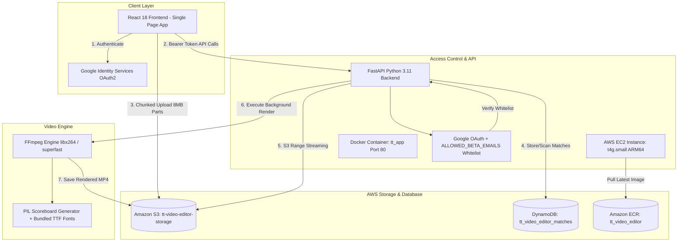
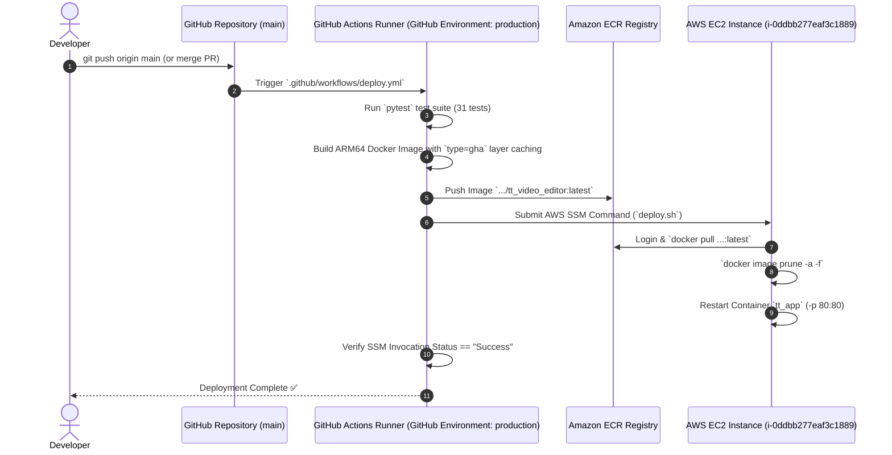

# System Architecture Document

## 1. Executive Summary & Purpose

The **Table Tennis Video Editor** is a web application for table tennis players and coaches. It automates video match scoring, rally highlight clipping, and custom high-definition scoreboard overlay rendering.

The application is deployed on a **single AWS EC2 instance** backed by **Amazon S3** for media storage, **Amazon DynamoDB** for match metadata, **Amazon ECR** for container deployment, and **Google OAuth + Email Whitelist** for cost protection and beta authorization.

---

## 2. System Architecture Topology



---

## 3. Component Deep Dive

### 3.1 Frontend (`frontend/`)
- **Technology**: React 18, TypeScript, Vite, Vanilla CSS.
- **Client-Side Routing**: SPA URL routing (`/login`, `/matches`, `/matches/:matchId`) with session persistence.
- **Key Components**:
  - **`DashboardView`**: Upload match videos, create match records, view user-scoped match cards.
  - **`WorkspaceView`**: Interactive rally tagging video player, score event logger, 2.5s live polling render status loop, and hotkeys (`±2.0s` seek via `ArrowLeft/Right` and `,/.`).
  - **`MatchStatsView`**: Zero-extra-input Table Tennis Match Analytics UI (Serve/Return Win %, Tactical Rally Duration Buckets `<4s`, `4-8s`, `>8s`, Max Point Streaks, and 1-click jump to longest rally).
  - **`SidebarLogs`**: Dual-tab sidebar switching between **Point Logs** and **Match Analytics**.
  - **`RenderHistory`**: List rendered video outputs with live status badges and execution duration pills (e.g. `⚡ 14.2s`).
  - **`GoogleLoginModal`**: Modal gating unauthenticated or unwhitelisted visitors.

### 3.2 Backend API (`app/`)
- **Technology**: Python 3.11, FastAPI, Uvicorn, Pydantic v2.
- **Key Modules**:
  - **`app/main.py`**: REST API endpoints for matches, direct S3 multipart uploads, 307 pre-signed S3 streaming redirects, render jobs, and authorization.
  - **`app/scoring.py`**: Automated scoring engine & ITTF service rotation analytics (`determine_server`, `compute_match_analytics`).
  - **`app/auth.py`**: Verifies Google OAuth ID tokens, enforces `ALLOWED_BETA_EMAILS` whitelist checks, and extracts user sub IDs for strict multi-tenant match isolation.
  - **`app/render_adapter.py`**: Background worker triggering FFmpeg highlight rendering, tracking start/end execution timestamps, and platform-aware encoder selection (`libx264` on Linux EC2 vs `h264_videotoolbox` on macOS).
  - **`app/database.py`**: Polymorphic repository supporting `DynamoDBRepository` (production) and `SQLiteRepository` (local dev).
  - **`app/storage.py`**: Polymorphic storage engine supporting `S3StorageProvider` (production user-scoped keys `uploads/{user_id}/{match_id}.mp4`, explicit `video/mp4` MIME headers, & direct multipart) and `LocalStorageProvider` (local dev).

### 3.3 Scoreboard & Video Processing Engine (`src/tt_video_editor/`)
- **Core Processing**:
  - **`ScoreboardGenerator`**: Renders custom high-definition 1080p table tennis score overlays.
  - **Bundled Fonts (`src/tt_video_editor/fonts/`)**: Includes `Scoreboard-Bold.ttf` and `Scoreboard-Regular.ttf` to guarantee 1080p typography rendering across Linux EC2 and macOS.
- **Direct S3 Range Streaming & Pre-Signed Redirects**:
  - Direct 307 temporary redirects to S3 pre-signed URLs with explicit `video/mp4` MIME headers enable GPU hardware video decoding and progressive range buffering in browsers while streaming directly from AWS S3 CDN infrastructure.

---

## 4. Cloud Infrastructure & Cost Model

| Service | Environment / Resource | Purpose | Monthly Cost |
| :--- | :--- | :--- | :--- |
| **Domain & CDN** | `jonsentt.site` (Cloudflare) | HTTPS SSL termination, DNS management, and 300+ Tbps DDoS protection | Free / ~$10/yr |
| **AWS EC2** | `t4g.small` (ARM64 Graviton2) | Live application server running Docker container `tt_app` on Port 80 | ~$12.26/mo |
| **Amazon S3** | `tt-video-editor-storage` | Production video storage (user-scoped keys `uploads/{user_id}/...`) | ~$0.023/GB |
| **Amazon DynamoDB** | `tt_video_editor_matches` | Multi-tenant NoSQL match metadata, logged rally events, and render history | Free Tier |
| **Amazon ECR** | `tt_video_editor` | Private Docker container registry for GitHub Actions deployments | < $0.50/mo |
| **Google OAuth** | Google Cloud Console | Identity authentication & beta whitelist security | Free |

---

## 5. Security & Multi-Tenant Guardrails

1. **Strict Multi-Tenant Match Isolation**:
   - Matches and video assets are scoped strictly by user (`owner_id` / `owner_username`).
   - S3 objects are isolated under `uploads/{user_id_or_email}/{match_id}.mp4` and `renders/{user_id_or_email}/{match_id}_{render_id}.mp4`.
2. **Google OAuth + Email Whitelist**:
   - Environment variable `ALLOWED_BETA_EMAILS="email1@gmail.com,email2@gmail.com"`.
   - API routes return `401 Unauthorized` for missing tokens and `403 Forbidden` for unapproved email addresses.
3. **Direct S3 Multipart Uploads & 307 Pre-Signed Streaming**:
   - Browser uploads 8MB chunks directly to AWS S3, consuming 0 MB of RAM/disk on the EC2 server.
   - Video streaming routes return HTTP 307 redirects directly to S3 pre-signed URLs with `ContentType: video/mp4`.
4. **S3 Storage Lifecycle Rules**:
   - 7-day automatic expiration rule for raw unrendered match uploads to prevent storage cost accumulation.
5. **EC2 Image Pruning & GHA Caching**:
   - Automatic `docker image prune -a -f` on every deployment and weekly Sunday 3 AM cron job.
   - GitHub Actions `type=gha` Docker layer caching for 5x faster deployments (~60s).

---

## 6. CI/CD Deployment Pipeline



---

## 7. Local Development & Testing Workflows

### 7.1 Local Development (`./start_dev.sh`)
- **Single Command Launch**: Running `./start_dev.sh` automatically builds the React frontend bundle (`frontend/`), loads environment variables from `.env.dev`, and starts the FastAPI backend server on `http://localhost:8000/`.
- **Dev Configuration (`.env.dev`)**:
  - `STORAGE_TYPE=s3` (or `local` for offline development)
  - `S3_BUCKET_NAME=tt-video-editor-storage-test` (isolated AWS test bucket)
  - `DYNAMODB_TABLE_NAME=tt_video_editor_matches_dev` (isolated AWS test table)
  - `AWS_REGION=us-east-2`

### 7.2 Testing & Quality Assurance
1. **Automated Backend Pytest Suite**:
   ```bash
   PYTHONPATH=src:app .venv/bin/pytest tests/
   ```
   Contains 31 automated unit tests covering scoring calculations, ITTF serve rotations, multi-tenant isolation, Google OAuth authentication, S3 multipart uploads, 307 pre-signed redirects, and background FFmpeg rendering.

2. **Frontend React Production Build**:
   ```bash
   cd frontend && npm run build
   ```
   Runs TypeScript type-checking (`tsc -b`) and Vite production bundle compilation (`vite build`).

3. **Visual & Browser Verification (Rule 1)**:
   All UI and full-stack changes are visually verified in the browser using Playwright (`browser_navigate`, `browser_take_screenshot`) before committing or opening a PR.

### 7.3 Git Worktree Workflow & Environment Configuration
- **Isolated Feature Branches**: When developing features in parallel, use Git worktrees (`git worktree add -b feature/<name> .worktrees/<name> main`).
- **`.env.dev` Symlinking**: Because Git worktrees do not automatically copy untracked `.gitignore` files, symlink `.env.dev` into the worktree directory so local dev servers (`./start_dev.sh`) and test runners have access to dev environment secrets while staying automatically in sync:
  ```bash
  ln -s $(pwd)/.env.dev .worktrees/<feature-name>/.env.dev
  ```
- **Cleanup**: Remove worktrees when feature branches are merged:
  ```bash
  git worktree remove --force .worktrees/<feature-name>
  ```
