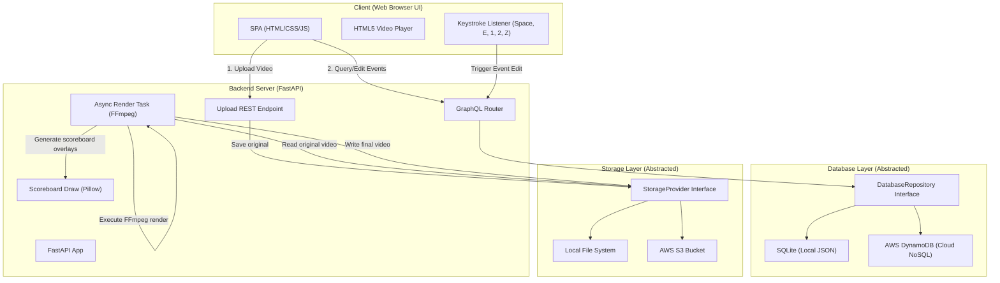

# Implementation Plan - Productionizing the Table Tennis Video Editor

We want to transform the local Python-based Table Tennis Video Editor into a production-ready web application that can be run on a cloud server. 

## NoSQL Database Options & Tradeoffs

To store match metadata, player names, settings, and events (which map directly to our hierarchical JSON format), we can use a NoSQL database. Here are the candidates and their tradeoffs:

| Database / Service | Pros | Cons | Recommendation |
| :--- | :--- | :--- | :--- |
| **AWS DynamoDB** | - Fully managed, serverless NoSQL.<br>- Extremely cheap (or free-tier) for low-to-medium volume.<br>- Maps perfectly to JSON document structures. | - AWS credentials setup required.<br>- Slight API complexity (using `boto3`). | **Excellent cloud choice**. |
| **MongoDB** | - Industry standard document store.<br>- Native BSON/JSON mapping. | - Requires running an external database service. | **Good option** for self-hosted VM setups. |
| **SQLite (JSON1)** | - Embedded, zero-configuration database (single file).<br>- Supports querying nested JSON. | - Single-server only (no distributed scaling). | **Excellent for local development** & fast debugging. |

### AWS Storage & Compute Options

To host the video files and run the backend on AWS:
- **Video Storage (AWS S3)**: We can store original and rendered videos in an S3 bucket instead of on the server's local disk. S3 is durable, cost-effective, and handles large sports videos beautifully.
- **Database (AWS DynamoDB)**: Keeps metadata records and events.
- **Compute (AWS EC2 / ECS)**: A simple EC2 VM or Docker container (ECS) is perfect for running FastAPI and executing the heavy FFmpeg rendering processes.

> [!TIP]
> We can design the code with abstract interfaces for **Storage** (`StorageProvider`) and **Database** (`DatabaseRepository`). This allows us to run on a **local file system and SQLite** during development, and switch to **AWS S3 and DynamoDB** for cloud production by simply toggling environment variables.

---

## Architecture Overview

Here is a high-level view of the application architecture, showing how the frontend, backend components, database, and storage layers interact:



We will build:
1. **Backend Server (FastAPI)**:
   - Integrates directly with our existing Python codebase (`tt_video_editor.scoreboard.scoreboard_generator`, `tt_video_editor.render`).
   - Exposes REST endpoints for video file uploads (efficient chunked streaming uploads).
   - Exposes a **GraphQL API** (using `strawberry-graphql` or `ariadne`) for querying match metadata and editing match events.
   - Saves original videos to a secure directory (e.g., `uploads/`) named by their unique match ID.
2. **Frontend UI (Single Page Application - SPA)**:
   - Built with modern vanilla HTML5, CSS (beautiful dark mode, glassmorphism, smooth animations), and JavaScript.
   - Integrates directly with browser keyboard events to recreate the fast manual editing shortcuts.

---

## Iterative Phases

We will work very iteratively as requested, starting with Phase 1:

### 1. Phase 1: Video Upload & Match Creation (Current Iteration)
- **Backend API**:
  - `POST /api/upload`: Handles video uploads with unique IDs (UUIDs), returns upload progress.
  - SQLite/JSON metadata store to save match records:
    ```json
    {
      "id": "uuid-v4",
      "name": "Jonsen vs. Ryan Lin",
      "player1": "Jonsen",
      "player2": "Ryan Lin",
      "created_at": "2026-07-12T13:05:13",
      "video_filename": "uuid-v4.mp4",
      "events": []
    }
    ```
- **Frontend UI**:
  - Match Creation form: input Player 1, Player 2, Match Name
  - Drag-and-drop file upload with a real-time progress bar.
  - Match dashboard displaying all created/uploaded matches.

### 2. Phase 2: Keystroke Event Editor & GraphQL API
- **Backend API**:
  - GraphQL queries/mutations to fetch match metadata and update the `events` array.
- **Frontend UI**:
  - Interactive editing workspace for a match.
  - Custom HTML5 Video Player playing the uploaded original video.
  - Keyboard shortcuts listener:
    - `SPACE`: Play/Pause
    - `E` or `D`: Set current frame as Point Start Time
    - `1` or `A`: Record point for Player 1 (sets end time, saves event)
    - `2` or `S`: Record point for Player 2 (sets end time, saves event)
    - `Z`: Undo last event
  - Event list sidebar showing all recorded events, allowing manual timestamp editing.

### 3. Phase 3: Video Rendering Integration
- Integrate with `src/tt_video_editor/render.py` to compile segments and overlay scoreboards.
- Backend background task (FastAPI BackgroundTasks or Celery/redis-less queue) to run FFmpeg rendering asynchronously.
- Frontend status indicators showing rendering progress.

### 4. Phase 4: Video Download
- Serve the rendered outputs for download via the UI.
- Cleanup temporary overlay segments to conserve server disk space.

### 5. Phase 5: Multi-Tenancy & User-Level Partitioning
- **Database Schema**: Add `owner_username` to the Match model. Set up DynamoDB with a composite key (Partition Key: `owner_username`, Sort Key: `id`) and add corresponding SQLite index.
- **Storage Partitioning**: Route raw uploads and rendered highlights to user-specific folders (e.g., `s3://<bucket>/<username>/uploads/`).
- **API Security**: Secure routes to filter data based on the authenticated user's credentials.

---

## Refactoring & Codebase Cleanup

To prepare the codebase for production and keep the architecture clean, we will perform a major refactoring and cleanup of the existing codebase.

### 1. Separation of Event Logging & Rendering
- **Event Logger (`core.py` and `manual_mode.py`)**: Responsible only for parsing player names/video parameters, running the CV2 window to capture manual keyboard events, and saving the resulting events JSON.
- **Renderer (`render.py`)**: Consolidated as the single source of truth for rendering. It will compile temporary segment PNG/MP4 files, run FFmpeg, and export the finished video with score overlays.
- **Integration**: `core.py`'s `main()` will be refactored to orchestrate: first calling `run_manual_mode()` to get events, then directly calling `process_video()` imported from `render.py`. This removes all duplicated rendering logic from `core.py`.

### 2. Deletion of Unused Features/Files
Per user request, we are removing all legacy, profiling, and unused features. Only the core manual editor (`scripts/tt_automator.py`) and renderer (`src/tt_video_editor/render.py`) will be kept.

---

## Proposed Changes (Phase 1)

### [Component: Existing Codebase Refactoring & Cleanup]

#### [MODIFY] [core.py](file:///Users/conniehuang/code/tt/tt_video_editor/src/tt_video_editor/core.py)
- **Remove Redundant `process_video(events, args)`**: Completely delete the duplicated rendering engine implementation (lines 83–347) and replace it by importing `process_video` directly from `render.py`.
- **Remove Redundant `create_proxy_file(input_file, proxy_path=None)`**: Completely delete the proxy creation logic (lines 348–391) as video proxy features are being retired.
- **Move `get_video_properties`**: Keep `get_video_properties` as a shared utility since it is used by both `manual_mode.py` and `render.py`, but ensure clean modular imports.
- **Refactor `main()`**: Decouple key events tracking from rendering by calling `run_manual_mode()` to get event JSON, saving it, and then delegating to `render.process_video()`.

#### [MODIFY] [render.py](file:///Users/conniehuang/code/tt/tt_video_editor/src/tt_video_editor/render.py)
- Clean up imports and references (e.g. resolve imports of `get_video_properties` from `core` without circular dependencies).
- Ensure it exposes a clean, reusable API for both the CLI and the web server.

#### [MODIFY] [pyproject.toml](file:///Users/conniehuang/code/tt/tt_video_editor/pyproject.toml)
- Remove deleted script entrypoints: `tt-capture`, `validate-matches`, `create-proxy`.
- Keep `tt-automator`, `tt-render`, and `preview-scoreboard`.

#### [MODIFY] [test_modules.py](file:///Users/conniehuang/code/tt/tt_video_editor/tests/test_modules.py)
- Remove tests verifying hybrid mode, proxy, and other deleted modules to keep the test suite green.

#### [DELETE] Unused Code files:
- [DELETE] `src/tt_video_editor/calibrate.py`
- [DELETE] `src/tt_video_editor/capture.py`
- [DELETE] `src/tt_video_editor/hybrid_mode.py`
- [DELETE] `src/tt_video_editor/proxy.py`
- [DELETE] `src/tt_video_editor/validate_matches.py`
- [DELETE] `check_matches.py`
- [DELETE] `perf_scripts/` (entire directory)

---

### [Component: Web Backend Server]

#### [NEW] [server.py](file:///Users/conniehuang/code/tt/tt_video_editor/src/tt_video_editor/server.py)
The FastAPI server entry point handling static file serving, chunked video uploads, metadata storage, and routing.

#### [NEW] [database.py](file:///Users/conniehuang/code/tt/tt_video_editor/src/tt_video_editor/database.py)
A lightweight metadata database wrapper implementing the repository pattern (backed by SQLite/JSON columns, easily swappable to MongoDB later).

### [Component: Frontend Web UI]

#### [NEW] [index.html](file:///Users/conniehuang/code/tt/tt_video_editor/src/tt_video_editor/static/index.html)
The SPA HTML template featuring modern semantic layouts.

#### [NEW] [style.css](file:///Users/conniehuang/code/tt/tt_video_editor/src/tt_video_editor/static/style.css)
Custom stylesheet with a sleek dark sports theme, glassmorphism, responsive grid, and custom file upload animations.

#### [NEW] [app.js](file:///Users/conniehuang/code/tt/tt_video_editor/src/tt_video_editor/static/app.js)
Frontend logic handling form submission, file upload API streaming, and dashboard updates.

---

## Verification Plan

### Automated Verification
- We will run the updated unit tests using:
  ```bash
  python -m unittest discover tests
  ```
- Lint and check codebase syntax: `ruff check`.

### Manual Verification
- Verify the refactored CLI works by running:
  - `python src/tt_video_editor/render.py --events <events_path> --no-game-cards <input> <output>`
  - `python scripts/tt_automator.py --names <names> <input> <output>`
- Run the FastAPI local server (`uvicorn`) and check the Phase 1 upload flow.
