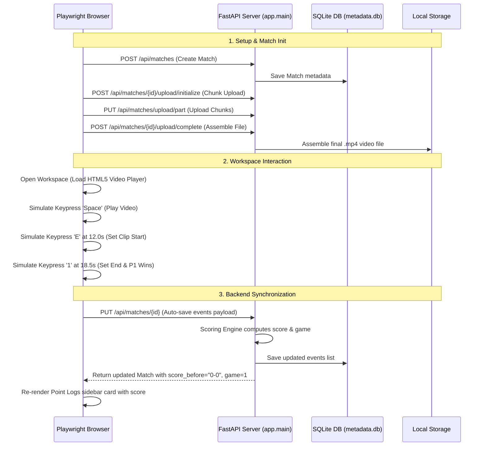

# Phase 2: Keystroke Event Editor & REST Integration Plan

We are building the Match Event Editor. This document details the step-by-step layout design, keyboard listener mechanics, and an incremental **Test-Driven Backend-First Verification Plan**.

---

## 💻 1. Backend-First & Unit-Test-Driven Implementation

To ensure absolute reliability, we implement the backend API and validation layer first, locking it down with automated unit tests before building the frontend.

### 📋 Pydantic Model Updates & Warning Fixes
When updating matches via `PUT /api/matches/{match_id}`, we must ensure submodels (like the list of `Event` objects) preserve their Pydantic classes to avoid serializer warnings.
* **The fix**: Instead of setting fields using the dictionary dumped by `model_dump()`, we retrieve the validated objects directly from `match_update` using `getattr(match_update, field)`:
  ```python
  update_data = match_update.model_dump(exclude_unset=True)
  for field in update_data.keys():
      value = getattr(match_update, field)
      setattr(match, field, value)
  ```
  This preserves the Pydantic classes and keeps the server logs clean and warning-free.

### 🧪 API Test Suite (`tests/test_api.py`)
We have created a dedicated test client class to test all endpoints. It performs:
1. **Create Match (`POST /api/matches`)**: Verifies ID generation and default attributes.
2. **List & Get Matches (`GET /api/matches`, `GET /api/matches/{id}`)**: Verifies data retrieval.
3. **Update Match Events (`PUT /api/matches/{id}`)**: Adds multiple nested events (rallies, scores, highlights, timeouts) and verifies persistence in the database.
4. **Initialize Upload (`POST /api/matches/{id}/upload/initialize`)**: Verifies chunk calculations.
5. **Delete Match (`DELETE /api/matches/{id}`)**: Verifies metadata and storage clean-up.

---

## 🎨 2. Workspace Layout & UI Design

Once the backend passes all tests, we build the Single Page Application (SPA) UI:

### Left Column: Media & Keyboard Reference
* **Back Button**: Returns the user to the matches list dashboard.
* **HTML5 Video Player**: Plays the video using the dynamic `match.video_url`.
* **Keystroke Status Bar**: Displays the currently marked values (e.g., `Point Start: 14.2s` or `None`).
* **Shortcuts Cheatsheet**:
  * `SPACE`: Play / Pause (prevents page scrolling).
  * `E` or `D`: Set current frame as **Start Time** of the point.
  * `1` or `A`: Set **End Time** and log point for **Player 1**.
  * `2` or `S`: Set **End Time** and log point for **Player 2**.
  * `Z`: Undo last event log.

### Right Column: Events List (Sidebar)
A scrollable vertical list of all logged points. Each point card contains:
* **Timeline Range Button**: Clicking it seeks the video player directly to the point's start time (`video.currentTime = start_time`).
* **Winner Display**: Shows which player won the point.
* **Inline Editable Fields**:
  * Game Number (Defaults to `1`).
  * Score Before (Auto-increments, editable in case of errors).
  * Highlight Toggle (⭐ checkbox/icon).
  * Timeout Selector (None, Player 1, Player 2).
* **Trash Icon**: Removes the event from the local list.

---

## ⌨️ 3. Keyboard Event Engine & Video Player Integration

The frontend workspace contains a native HTML5 video player and a global keyboard event engine that replicates the core functionality of the original OpenCV-based manual event recorder (`collect_events`).

### Video Player Mechanics
* **Player Initialization**: The player mounts the HTML5 `<video>` element, loading the video either from a temporary S3 pre-signed playback URL (`match.video_url`) or falling back to a local storage server path (`/static/videos/uploads/{match.video_filename}`).
* **Timeline Seeking**: Clicking the timestamp button on any event card in the sidebar triggers a seek operation: `videoPlayer.currentTime = event.start`, which immediately starts playing the clip.

### Global Keyboard Listener
A global listener on `window` captures keystroke events and maps them to the following playback and logging operations:
* **Play / Pause (`SPACE`)**: Toggles the play/pause state. The event listener prevents default browser behavior to stop page scrolling.
* **Mark Start (`E` or `D`)**: Sets `pendingStartTime = videoPlayer.currentTime` and updates the UI status bar (e.g., displaying `Pending Start Time: 14.5s`).
* **Log Player 1 Winner (`1` or `A`)**: Captures `endTime = videoPlayer.currentTime`. Validates `endTime > pendingStartTime`, creates a new `Event` object with `winner = player1`, pushes it to the match's events list, clears the pending start marker, and triggers `autoSaveEvents()`.
* **Log Player 2 Winner (`2` or `S`)**: Performs the same sequence as above, but with `winner = player2`.
* **Undo Last Event (`Z`)**: Pops the last logged event from the array and triggers `autoSaveEvents()`, rewinding/reverting the event list.

### Constraints & Edge Cases
* **Focus Safety Check**: To allow typing in input elements (like match name, player name, active game inputs) or select dropdowns, the listener is immediately bypassed if `document.activeElement` is an `INPUT`, `TEXTAREA`, or `SELECT` element.
* **Time Validation**: If the user tries to log a point (pressing `1`/`2`/`A`/`S`) without first marking a start time, or if the current video position is less than or equal to the marked start time, the logging is rejected with an alert to prevent corrupted timestamps.

### Backend Synchronization
* **Auto-Save & Re-Calculation**: Unlike local file writes, the web client synchronizes state automatically in the background on any event list mutation (logs, inline deletes, highlight status toggles, or timeout changes).
* **Score Computations**: The client makes a `PUT /api/matches/{match_id}` request payload with the modified events list. The FastAPI backend routing processes this payload through the `compute_scores_and_games` scoring engine in [scoring.py](file:///Users/conniehuang/.gemini/antigravity-cli/worktrees/phase2-event-editor/app/scoring.py). It sorts the events chronologically, computes the running score (e.g. `0-0` -> `1-0`), handles game count transitions (at 11 points or via deuce rules), and returns the updated match metadata.
* **UI Re-rendering**: The client receives the processed events array containing the backend-calculated running scores and game numbers, then dynamically re-builds the sidebar event list.

---

## 📈 4. Status Update & Phase 2 Completion Report

We have completed the implementation of both the backend and frontend components for Phase 2:
* **Backend API Endpoints**: Exposes fully functional REST endpoints (`GET`, `POST`, `PUT`, `DELETE`) for match metadata CRUD operations, and supports chunked multipart uploads.
* **Scoring Engine**: Implemented in [scoring.py](file:///Users/conniehuang/.gemini/antigravity-cli/worktrees/phase2-event-editor/app/scoring.py) and validated via `tests/test_api.py`.
* **Web UI Workspace**: Layout split grid with the HTML5 Video player, shortcuts cheat sheet, pending start indicator, active game selector, and a scrollable, interactive points log sidebar.
* **Global Keystroke Listener**: Captures and validates keyboard inputs, updates frontend state, and triggers seamless background auto-saving.

---

## 🧪 5. End-to-End (E2E) Test Plan

To ensure the backend API integration, video playback events, and keystroke shortcut listeners perform reliably in a browser environment, we specify a browser-automated E2E verification plan.

### E2E Architecture & Flow



### E2E Test Tooling
We use **Playwright** (Python library `playwright`) for E2E testing because:
1. It supports headless execution on CI/CD (GitHub Actions).
2. It has native APIs to dispatch real keyboard shortcut events.
3. It can query and wait for elements in the DOM dynamically (avoiding flaky timing issues).
4. It supports HTML5 video playback state inspection (checking `paused`, `currentTime`).

### E2E Test Scenarios

1. **Match Upload Flow**:
   * Navigate to the dashboard.
   * Enter match name ("E2E Match") and player names.
   * Select a test video file, verify upload progress reaches 100%, and check that the match is listed with a "ready" status.
2. **Video Playback & Shortcut Event Tracking**:
   * Click on the match card to enter the workspace.
   * Check that the HTML5 video player is loaded.
   * Simulate a `Space` keypress and verify that the video is playing (`video.paused == false`).
   * Simulate a `Space` keypress again to pause.
   * Seek video to 5.0 seconds.
   * Press `E` to set start time, checking that the pending start label updates to `5.0s`.
   * Play or seek video to 10.0 seconds.
   * Press `1` to log the point for Player 1.
   * Verify that a new card is added to the sidebar displaying the winner and the correct score before (`0-0`).
   * Verify that a background `PUT` request is completed and saved.
3. **Scoring Rules Validation**:
   * Log 11 points consecutively for Player 1.
   * Log 1 point. Verify that the 12th point card shows `game: 2` and `score_before: 0-0` (reflecting standard game resets).
4. **Auto-Save & Deletion Persistence**:
   * Reload the page.
   * Enter the workspace again.
   * Verify that all point logs are retrieved from the database and loaded into the sidebar correctly.
   * Click "Delete" on one of the events, check that the card disappears, and verify the backend database is synchronized.

### E2E Playwright Script Example (`tests/test_e2e.py`)

Here is an automated E2E test implementation script using `pytest` and `playwright`:

```python
import subprocess
import time
import socket
import pytest
from playwright.sync_api import sync_playwright

def is_port_open(port):
    with socket.socket(socket.AF_INET, socket.SOCK_STREAM) as s:
        return s.connect_ex(("127.0.0.1", port)) == 0

@pytest.fixture(scope="module")
def fastapi_server():
    # Setup test env variables
    env = {
        **subprocess.os.environ,
        "DB_TYPE": "local",
        "STORAGE_TYPE": "local",
        "LOCAL_STORAGE_DIR": "storage_e2e_test",
        "PORT": "8080"
    }
    # Clean up old database
    if subprocess.os.path.exists("metadata.db"):
        subprocess.os.remove("metadata.db")
    
    # Start server
    proc = subprocess.Popen(
        ["python", "-m", "uvicorn", "app.main:app", "--port", "8080"],
        env=env
    )
    
    # Wait for server to start
    for _ in range(30):
        if is_port_open(8080):
            break
        time.sleep(0.2)
    else:
        proc.terminate()
        raise RuntimeError("FastAPI server failed to start.")
        
    yield "http://127.0.0.1:8080"
    
    # Teardown server
    proc.terminate()
    proc.wait()
    if subprocess.os.path.exists("metadata.db"):
        subprocess.os.remove("metadata.db")
    import shutil
    if subprocess.os.path.exists("storage_e2e_test"):
        shutil.rmtree("storage_e2e_test")

def test_editor_keystrokes_and_scoring(fastapi_server):
    with sync_playwright() as p:
        browser = p.chromium.launch(headless=True)
        page = browser.new_page()
        
        # 1. Load Dashboard
        page.goto(fastapi_server + "/static/index.html")
        page.wait_for_selector("#match-form")
        
        # Fill Form
        page.fill("#match-name", "Grand Finals")
        page.fill("#player1", "Alice")
        page.fill("#player2", "Bob")
        
        # Simulate file select (mock video upload)
        # Note: In mock test, you'd specify a path to a real small video file
        # page.set_input_files("#file-input", "tests/assets/test_short.mp4")
        # page.click("#submit-btn")
        # ...
        
        # 2. Enter Workspace (Assuming match is created and video ready)
        # For direct keystroke testing without file uploading in unit E2E:
        # We can seed a match via API
        import requests
        res = requests.post(fastapi_server + "/api/matches", json={
            "name": "E2E Keystroke Test", "player1": "Alice", "player2": "Bob"
        })
        match_id = res.json()["id"]
        
        # Seed raw video placeholder file
        import os
        os.makedirs("storage_e2e_test/uploads", exist_ok=True)
        with open(f"storage_e2e_test/uploads/{match_id}.mp4", "wb") as f:
            f.write(b"fake video data")
        
        # Update match in DB to link video filename
        requests.put(fastapi_server + f"/api/matches/{match_id}", json={
            "video_filename": f"{match_id}.mp4"
        })
        
        # Reload Page & Open Match
        page.goto(fastapi_server + "/static/index.html")
        page.click(f".match-item[data-id='{match_id}']")
        page.wait_for_selector("#video-player")
        
        # 3. Simulate Video Player and Keyboard events
        video = page.locator("#video-player")
        
        # Mock HTML5 Video Player current duration & timeline playback for test stability
        page.evaluate("document.getElementById('video-player').duration = 600")
        page.evaluate("document.getElementById('video-player').play = () => {}")
        page.evaluate("document.getElementById('video-player').pause = () => {}")
        
        # Play Video
        page.keyboard.press("Space")
        # Set start time (Press E at 10.0s)
        page.evaluate("document.getElementById('video-player').currentTime = 10.0")
        page.keyboard.press("KeyE")
        
        # Check start label
        assert page.locator("#pending-start-label").inner_text() == "10.0s"
        
        # Set end time & log point for Alice (Press 1 at 15.0s)
        page.evaluate("document.getElementById('video-player').currentTime = 15.0")
        page.keyboard.press("Digit1")
        
        # Check event card rendering in Point Logs
        page.wait_for_selector(".event-card")
        event_winner = page.locator(".event-winner").first.inner_text()
        assert "Alice Wins Point" in event_winner
        
        # Check running score computed by backend scoring engine
        event_details = page.locator(".event-details").first.inner_text()
        assert "Score: 0-0" in event_details
        
        # 4. Check auto-save retrieval
        page.reload()
        page.click(f".match-item[data-id='{match_id}']")
        page.wait_for_selector(".event-card")
        assert "Alice Wins Point" in page.locator(".event-winner").first.inner_text()
        
        browser.close()
```


