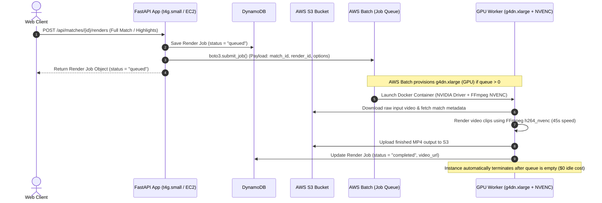

# Architecture & Implementation Plan: On-Demand GPU Video Rendering via AWS Batch

This document outlines the architecture, performance characteristics, and implementation plan for offloading video rendering jobs from the main application server to **AWS Batch** with **On-Demand / Spot NVIDIA GPU instances (`g4dn.xlarge`)**.

This provides **10x–20x faster video rendering** via hardware-accelerated NVIDIA `h264_nvenc`, while maintaining **$0.00 idle costs**.

---

## 🏗️ 1. High-Level Architecture Flow



---

## 🛠️ 2. AWS Infrastructure Components

### A. AWS Batch Compute Environment
* **Instance Family**: `g4dn.xlarge` (NVIDIA T4 Tensor Core GPU, 4 vCPUs, 16 GB RAM).
* **Provisioning Model**: **Spot Instances** (with On-Demand fallback for maximum reliability).
  * *Spot Price*: **~$0.15 / hour** (71% discount off $0.52/hr).
* **Allocation Strategy**: `BEST_FIT_PROGRESSIVE`.
* **Minimum vCPUs**: `0` *(Ensures scale-to-zero when idle = $0.00/hr)*.
* **Maximum vCPUs**: `16` *(Allows up to 4 parallel GPU render jobs simultaneously)*.
* **Scale-down Idle Timeout**: `120 seconds` (Terminates GPU server 2 mins after last job completes).

### B. AWS Batch Job Queue & Job Definition
* **Job Queue**: `tt-video-editor-gpu-queue`
* **Job Definition**: `tt-video-editor-gpu-renderer`
* **Resource Requirements**: 1 GPU (`nvidia.com/gpu: 1`), 4 vCPUs, 8000 MB RAM.

### C. Amazon ECR Repository
* Docker container image repository: `<aws_account_id>.dkr.ecr.us-east-2.amazonaws.com/tt-video-editor-gpu-worker:latest`.

---

## ⚡ 3. Performance, Peak Traffic & Cold Start Dynamics

### A. Peak Traffic Behavior (Instance Re-use & Auto-Scaling)
* **Instant Job Re-Use**: When multiple jobs are queued back-to-back, AWS Batch **keeps running GPU instances warm and active**. As soon as Job #1 completes, Job #2 begins immediately on the same GPU instance with 0 spin-up delay.
* **Horizontal Scaling**: If 10 users click "Render Highlights" simultaneously, AWS Batch auto-scales horizontally up to `maxvCpus` (e.g. launching up to 4 parallel `g4dn.xlarge` instances) so all jobs execute concurrently.
* **Scale-to-Zero Cleanup**: AWS Batch only starts its 120-second idle countdown timer **after the job queue reaches 0 remaining jobs**.

### B. Cold Start vs. Warm Start Timing

| Lifecycle Stage | Action | Duration |
| :--- | :--- | :--- |
| **EC2 Provisioning** | AWS provisions `g4dn.xlarge` VM & attaches NVIDIA T4 GPU | ~20 – 30s |
| **Docker Layer Pull** | Internal AWS ECR layer download (10Gbps AWS backbone) | ~5 – 15s |
| **CUDA Driver Init** | Container launch & NVIDIA CUDA/NVENC initialization | ~2 – 5s |
| **TOTAL COLD START** | **From $0 idle to rendering 1st video frame** | **~30 – 50s** |

* 🥶 **Cold Start (1st render after idle)**: ~35s EC2 boot + 45s render = **~1m 20s total**.
* 🔥 **Warm Start (Subsequent renders during active traffic)**: 0s EC2 boot + 45s render = **45s total**.

### C. Cold-Start Optimization Strategies
1. **Pre-Cached AMI**: Pre-baking Docker container layers into a custom AMI drops cold-start provisioning down to **~15–20 seconds**.
2. **Scheduled Daytime Warm Instances**: Setting `minvCpus = 4` during peak hours (9 AM – 6 PM) keeps 1 GPU instance continuously warm for **~$0.15/hr** Spot rate, and setting `minvCpus = 0` overnight.

---

## 💰 4. Cost Breakdown

| Activity | Instance & Pricing | Execution Time | Cost per Video |
| :--- | :--- | :--- | :--- |
| **Idle State (0 users rendering)** | Scale-to-Zero (`0 vCPUs`) | Always $0.00 | **$0.00** |
| **1 Render Job (Spot)** | `g4dn.xlarge` Spot (~$0.15/hr) | **45 seconds** | **~$0.0019** |
| **1 Render Job (On-Demand)** | `g4dn.xlarge` On-Demand ($0.52/hr) | **45 seconds** | **~$0.0065** |
| **100 Render Jobs / Month** | `g4dn.xlarge` Spot | ~75 minutes total | **~$0.19 / month** |

---

## 💻 5. Software & Code Implementation

### Step 1: GPU Worker Dockerfile (`docker/Dockerfile.gpu`)
```dockerfile
FROM nvidia/cuda:11.8.0-runtime-ubuntu22.04

RUN apt-get update && apt-get install -y \
    python3.9 python3-pip ffmpeg libsm6 libxext6 libgl1-mesa-glx curl \
    && rm -rf /var/lib/apt/lists/*

WORKDIR /app
COPY requirements.txt .
RUN pip install --no-cache-dir -r requirements.txt

COPY app/ ./app
COPY src/ ./src
COPY scripts/run_gpu_render_job.py ./scripts/

ENTRYPOINT ["python3", "scripts/run_gpu_render_job.py"]
```

### Step 2: FFmpeg Hardware Acceleration Adapter (`src/tt_video_editor/core.py`)
```python
# Hardware encoder detection:
encoder = "h264_nvenc" if is_gpu_available() else "libx264"
ffmpeg_cmd = [
    "ffmpeg", "-y", "-i", input_path,
    "-c:v", encoder,
    "-preset", "p4" if encoder == "h264_nvenc" else "fast",
    "-b:v", "6000k",
    output_path
]
```

### Step 3: AWS Batch Dispatcher in Backend (`app/main.py`)
```python
if os.getenv("AWS_BATCH_JOB_QUEUE"):
    batch_client = boto3.client("batch", region_name=AWS_REGION)
    batch_client.submit_job(
        jobName=f"render-{match_id}-{render_id}",
        jobQueue=os.getenv("AWS_BATCH_JOB_QUEUE"),
        jobDefinition=os.getenv("AWS_BATCH_JOB_DEF"),
        containerOverrides={
            "environment": [
                {"name": "MATCH_ID", "value": match_id},
                {"name": "RENDER_ID", "value": render_id},
            ]
        }
    )
```

---

## 🚦 6. Implementation Roadmap

1. **Phase 1 (Code Adaptations)**:
   - Add `h264_nvenc` encoder option to `core.py` and `s3_streaming_render_adapter.py`.
   - Create standalone worker script `scripts/run_gpu_render_job.py`.
2. **Phase 2 (AWS Infrastructure Provisioning)**:
   - Create ECR repository `tt-video-editor-gpu-worker`.
   - Provision AWS Batch Compute Environment & Job Queue with `g4dn.xlarge` Spot instances via Terraform/AWS CLI.
3. **Phase 3 (Backend & E2E Verification)**:
   - Connect `boto3.submit_job` inside `app/main.py`.
   - Run end-to-end load tests verifying sub-minute rendering times and automatic scale-to-zero.
