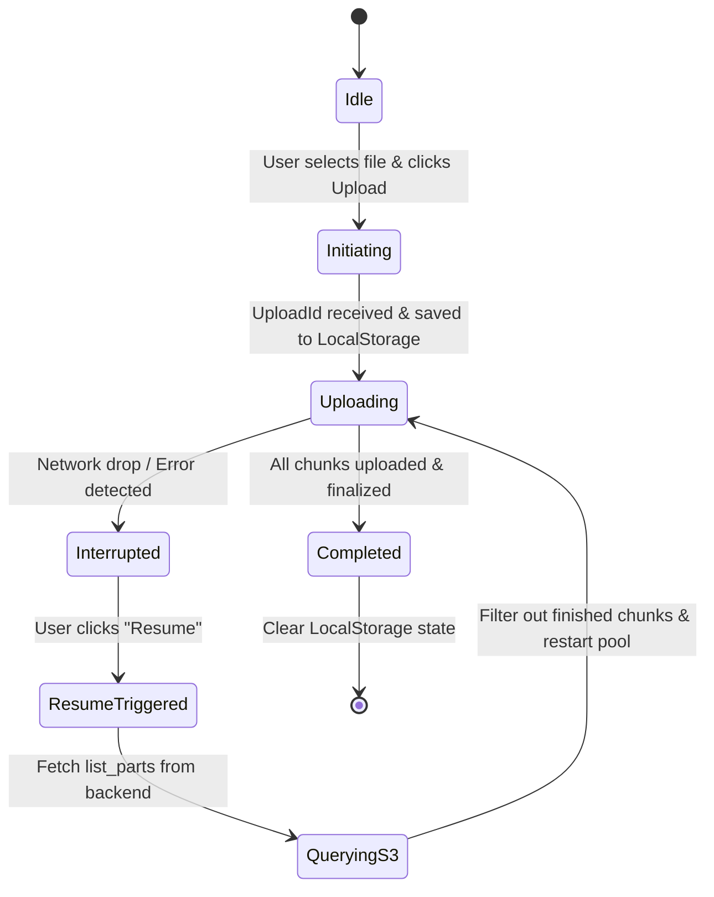

# Plan: Resilient S3 Multipart Upload Resume

This plan outlines the architecture, backend changes, and frontend changes required to make the video upload endpoint resilient to network drops and capable of resuming interrupted uploads.

---

## 🏗️ Architecture Design



---

## 🛠️ Step 1: Backend S3 ListParts API Support

To resume an upload, the frontend must query AWS S3 to see which chunks have already successfully arrived. Since frontend clients shouldn't have raw AWS credentials, the backend will act as a secure proxy.

### 1. Update `StorageProvider` Interface
Modify [app/storage.py](file:///Users/conniehuang/code/tt/tt_video_editor/app/storage.py) to declare a new `list_parts` method:

```python
# In StorageProvider interface:
@abstractmethod
def list_parts(self, remote_name: str, upload_id: str) -> List[Dict]:
    """Lists already uploaded parts for an active multipart upload."""
    pass
```

### 2. Implement in `LocalStorageProvider`
Supports local development testing:
```python
# In LocalStorageProvider:
def list_parts(self, remote_name: str, upload_id: str) -> List[Dict]:
    import os
    upload_dir = os.path.join(self.temp_dir, upload_id)
    if not os.path.exists(upload_dir):
        return []
    parts = []
    for name in os.listdir(upload_dir):
        if name.isdigit():
            parts.append({
                "PartNumber": int(name),
                "ETag": f'"mock-etag-{name}"'
            })
    return parts
```

### 3. Implement in `S3StorageProvider`
Calls S3's `list_parts` API, handling pagination if there are more than 1000 parts:
```python
# In S3StorageProvider:
def list_parts(self, remote_name: str, upload_id: str) -> List[Dict]:
    parts = []
    kwargs = {
        "Bucket": self.bucket_name,
        "Key": remote_name,
        "UploadId": upload_id
    }
    while True:
        response = self.s3_client.list_parts(**kwargs)
        if "Parts" in response:
            for part in response["Parts"]:
                parts.append({
                    "PartNumber": part["PartNumber"],
                    "ETag": part["ETag"]
                })
        if response.get("IsTruncated"):
            kwargs["PartNumberMarker"] = response["NextPartNumberMarker"]
        else:
            break
    return parts
```

### 4. Create endpoint in `app/main.py`
Expose the endpoint `GET /api/matches/{match_id}/upload/parts` in [app/main.py](file:///Users/conniehuang/code/tt/tt_video_editor/app/main.py):
```python
@app.get("/api/matches/{match_id}/upload/parts")
def list_parts(match_id: str, upload_id: str, original_filename: str):
    """Lists already uploaded parts for an active multipart upload session."""
    ext = os.path.splitext(original_filename)[1].lower() or ".mp4"
    unique_storage_name = f"{match_id}{ext}"
    remote_path = f"uploads/{unique_storage_name}"
    
    try:
        parts = storage.list_parts(remote_name=remote_path, upload_id=upload_id)
        return {"parts": parts}
    except Exception as e:
        raise HTTPException(
            status_code=status.HTTP_500_INTERNAL_SERVER_ERROR,
            detail=f"Failed to query uploaded parts: {str(e)}"
        )
```

---

## 💻 Step 2: Frontend State Machine & UI Integration

We will modify [app/static/app.js](file:///Users/conniehuang/code/tt/tt_video_editor/app/static/app.js) to manage the local state and support resuming.

### 1. Local State Storage Structure
Each upload will be saved to `localStorage` under `s3_upload_{match_id}`:
```json
{
  "matchId": "vytxeJKJygguct7vC6Lxw",
  "uploadId": "example-upload-id-from-aws",
  "originalFilename": "ping_pong_match.mp4",
  "fileSize": 104857600
}
```

### 2. Update Error Handling
- Remove the automatic `/abort` HTTP call on worker failure.
- When an error occurs (such as a timeout or connection issue), catch it and keep the local state intact.
- Show a "Resume Upload" button next to the progress bar.

### 3. Implement the Resume Flow
When the "Resume" button is clicked:
1. Fetch the already uploaded parts from the new `/parts` backend endpoint using the saved `uploadId`.
2. Construct the remaining list of chunks to upload by filtering out those already returned by the server.
3. Repopulate `completedParts` in the browser with the ETags of the chunks already on S3.
4. Restart the concurrent worker pool for the remaining chunks.
5. Once all remaining chunks are uploaded, invoke `/complete` as normal.
6. Clear the `localStorage` state on successful completion.

---

## 🔍 Validation Plan

1. **Verify Local State Saving**: Initiate an upload, refresh the browser page, and check `localStorage` to confirm metadata is saved.
2. **Simulate Connection Drop**: 
   - Start an upload of a large file.
   - Pause or disable network connection (e.g. go offline in DevTools).
   - Confirm that the upload halts and a "Resume Upload" button appears without calling `/abort`.
3. **Simulate Connection Restored**:
   - Re-enable the network connection.
   - Click "Resume Upload".
   - Confirm via network logs that `/parts` is called and only the remaining parts are sent.
   - Confirm the upload completes and the video stitches successfully on S3.
