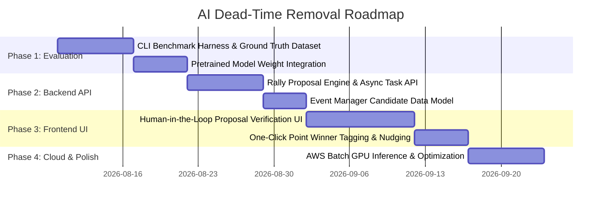

# AI Dead-Time Removal & Auto-Rally Detection — Phased Implementation Plan

## 📌 Executive Summary
This document outlines a phased, iterative plan for integrating AI-based dead-time removal (rally boundary detection) into the **Table Tennis Video Editor**. 

The goal is to automate the time-consuming process of manually scrubbing through match footage to locate rally start/end points, enabling users to generate clean match highlights and scoreboards in under **3 minutes per match**.

The plan prioritizes an offline benchmarking harness first, followed by backend API integration, a human-in-the-loop frontend review interface, and optional cloud inference.

---

## 🎯 System Goals & Key Metrics

1. **85%+ Human Time Reduction:** Cut manual match logging time from ~30 minutes down to < 3 minutes per 5-set match.
2. **High Rally Proposal Accuracy:** Achieve $\ge 90\%$ recall on rally start/end interval detection using pre-trained open models ([TrackNetV3](https://github.com/wasn-lab/TrackNetV3_TableTennis) / [BlurBall](https://github.com/cogsys-tuebingen/blurball)).
3. **100% Manual Fallback Guarantee:** Existing manual logging hotkeys (`Space`, `1`, `2`, `E`, `H`) and workflow remain fully functional as an optional or primary path.

---

## 🗓️ Phased Development Roadmap



---

### 🧪 Phase 1: Local Model Benchmarking & Evaluation Harness
*Objective: Quantify pre-trained model accuracy against existing annotated ground-truth matches before changing application UI or API.*

#### Key Deliverables
* **Evaluation Harness Script (`scripts/eval_point_detector.py`):**
  * Load an input MP4 match video and its corresponding ground-truth `events.json` (e.g., `jonsen_vs_eugene_events.json`).
  * Run [PointDetector](file:///Users/conniehuang/code/tt/tt_video_editor/src/tt_video_editor/ml/point_detector.py) using pretrained weights (`TrackNet_best.pt` or `tracknetv2.pth`).
  * Calculate **Temporal Intersection over Union (Temporal IoU)**, **Precision**, **Recall**, and **F1-Score** for detected rally intervals `[start_time, end_time]`.
* **Parameter Tuning & Padding Optimization:**
  * Benchmark optimal post-processing parameters:
    * `confidence_threshold` (e.g., 0.55 – 0.70)
    * `min_rally_duration` (e.g., 1.2s)
    * `start_padding_sec` (e.g., +1.0s prior to serve)
    * `end_padding_sec` (e.g., +0.8s post point end)
* **Performance Baseline:**
  * Measure inference speed (Frames Per Second and Real-Time Factor) on macOS (`mps`) and standard CPU environments.

---

### ⚡ Phase 2: Backend API & Candidate Proposal Pipeline
*Objective: Build backend API endpoints and data models for asynchronous rally proposal generation.*

#### Key Deliverables
* **Candidate Data Model (`ProposedRally`):**
  * Extend [models.py](file:///Users/conniehuang/code/tt/tt_video_editor/src/tt_video_editor/models.py) and backend DynamoDB/SQLite match schema to store `proposed_rallies`:
    ```json
    {
      "proposal_id": "prop_01",
      "start_time": 14.2,
      "end_time": 21.8,
      "confidence": 0.88,
      "status": "unassigned"  // "unassigned", "accepted", "dismissed"
    }
    ```
* **Asynchronous Detection Endpoint (`/api/matches/{match_id}/auto-detect`):**
  * Trigger background worker task using FastAPI `BackgroundTasks` to run `PointDetector` on uploaded S3 / local MP4 files.
  * Expose job status via `/api/matches/{match_id}/auto-detect/status` (`QUEUED`, `PROCESSING`, `COMPLETED`, `FAILED`).
* **Non-Destructive Event Generation:**
  * Ensure AI proposals never overwrite existing user-logged events in `events.json`.

---

### 🖥️ Phase 3: Frontend "Human-in-the-Loop" Verification UI
*Objective: Empower users to review AI-proposed rally clips, assign point winners with one click, and fine-tune start/end bounds.*

#### Key Deliverables
* **"Auto-Detect Rallies" Button & Progress Pill:**
  * Add an action button on the Match Logging page to trigger rally proposals with a live progress indicator.
* **Proposed Rally Timeline & Quick Tagging Panel:**
  * Display a list of proposed rally clips sorted chronologically.
  * For each proposed rally clip:
    * **1-Click Winner Tagging:** `P1 Win (1)` / `P2 Win (2)` buttons instantly convert the candidate into a confirmed match event and calculate current game scores.
    * **Quick Preview:** Clicking a proposed rally seeks the video player directly to `start_time - 1.0s`.
    * **Interval Nudge Controls:** `[-0.5s]` / `[+0.5s]` buttons for fine-tuning rally start and end points.
    * **Dismiss Button (`X`):** Discards false positive proposals (e.g., ball retrieval or warm-up hits).
* **Manual Mode Parity:**
  * Users can seamlessly switch between AI proposals and full manual point logging at any time.

---

### ☁️ Phase 4: Optimization, Cloud GPU Inference & Fallbacks
*Objective: Scale processing to long 4K/60FPS matches and provide robust fallback mechanisms.*

#### Key Deliverables
* **Cloud GPU Inference (AWS Batch / EC2 Worker):**
  * For production environments without local GPU hardware, delegate heavy `PointDetector` inference jobs to AWS Batch GPU instances (`g4dn.xlarge` with NVIDIA T4) or background worker nodes.
* **Model Weight Download & Caching Manager:**
  * Automatic caching of pre-trained model weights (`weights/TrackNet_best.pt`) on server initialization with SHA-256 integrity checks.
* **Graceful Degradation:**
  * If weights are missing or PyTorch/CUDA is unavailable, the UI cleanly hides the "Auto-Detect" option and defaults to manual hotkey logging.

---

## 📊 Verification & Acceptance Criteria

| Criteria | Target Metric | Verification Method |
| :--- | :--- | :--- |
| **Rally Interval Recall** | $\ge 90\%$ | `scripts/eval_point_detector.py` against 3+ reference ground-truth matches |
| **Match Logging Efficiency** | $< 3$ mins / match | User timing test on a 5-set match video |
| **Score State Accuracy** | 100% | Dynamic score calculator verification post user winner tagging |
| **Backward Compatibility** | 100% | Unit tests in `tests/test_event_manager.py` pass without regression |

---

## 🔗 Related Documentation
* [System Architecture Overview](../../architecture/ARCHITECTURE.md)
* [AWS Batch GPU Rendering Plan](./AWS_BATCH_GPU_RENDERING.md)
* [Point Detector ML Module](../../../src/tt_video_editor/ml/point_detector.py)
