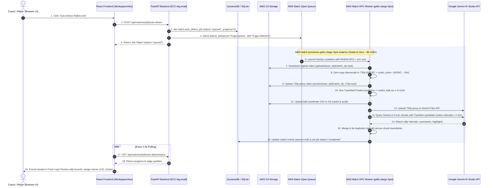
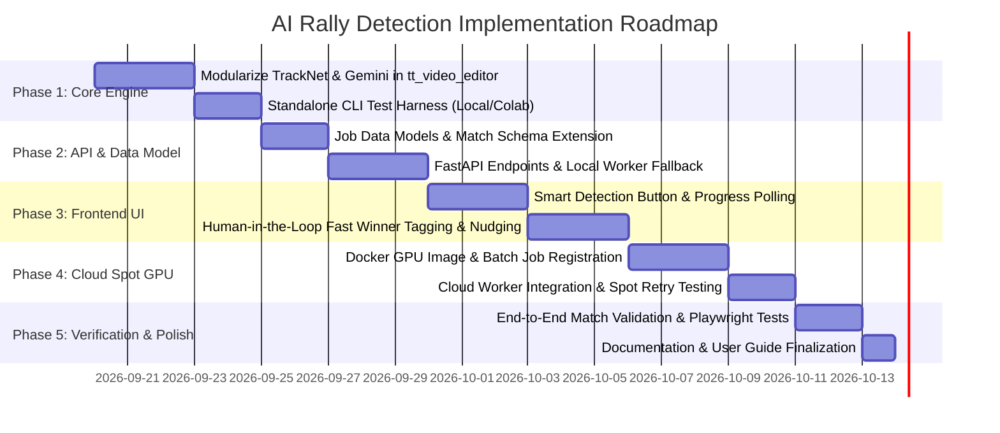

# AI Dead-Time Removal & Auto-Rally Detection — Architecture & Implementation Plan

## 📌 Executive Summary

This document defines the production cloud architecture, technical data flow, and phased iterative rollout for automated table tennis rally detection and dead-time removal in the **Table Tennis Video Editor**.

The objective is to automate the time-consuming process of manually scrubbing match footage to locate rally start/end boundaries, cutting total match logging time from **30+ minutes down to < 3 minutes per match** while maintaining a 100% human-in-the-loop manual fallback guarantee.

Following empirical validation in `tracknetv3_poc.ipynb` and `scripts/chunked_gemini_rally_detector.py`, the production system integrates:
1. **720p Zero-Copy GPU Transcoding:** Fast downscaling of high-resolution footage (1080p / 4K @ 60fps) using NVIDIA hardware acceleration (`NVDEC` + `scale_cuda` + `NVENC`).
2. **TrackNetV3 Ball Trajectory Spotting:** High-speed ball tracking (`TrackNet_best.pt` + `InpaintNet_best.pt`) generating coordinate telemetry and candidate high-motion intervals.
3. **Chunked Gemini Multimodal Temporal Reasoning:** 5-minute video chunks evaluated by Google Gemini with TrackNet candidate motion guidance, eliminating LLM attention decay and false-positive hallucinations.
4. **Human-in-the-Loop UI Verification:** Starting timestamps populate the match event log in the UI, where users rapidly assign point winners (`1` / `2`) and fine-tune boundaries.
5. **Scale-to-Zero AWS Spot GPU Inference:** Offloading heavy compute to AWS Batch with `g4dn.xlarge` Spot instances (~$0.15/hr, $0.00 idle cost), with local fallback for offline development.

---

## 🎯 System Goals & Key Metrics

1. **85%+ Human Time Reduction:** Cut manual match logging time from ~30 minutes down to < 3 minutes per 5-set match.
2. **High Boundary Precision:** Eliminate dead time (toweling off, ball retrieval, warm-ups, timeouts, set breaks) while ensuring serves and point reactions are properly padded (+1.5s).
3. **Scale-to-Zero Cost Efficiency:** Compute cost under **$0.05 per 30-minute match** using AWS Spot instances and Gemini Flash models.
4. **100% Non-Destructive Fallback:** Existing manual logging hotkeys (`Space`, `1`, `2`, `E`, `D`, `H`) and inline editor workflows remain fully intact.

---

## 🏗️ End-to-End System Architecture

### Sequence Flow Diagram


```mermaid
sequenceDiagram
    autonumber
    actor User as Coach / Player (Browser UI)
    participant UI as React Frontend (WorkspaceView)
    participant API as FastAPI Backend (EC2 t4g.small)
    participant DB as DynamoDB / SQLite
    participant S3 as AWS S3 Storage
    participant Batch as AWS Batch (Spot Queue)
    participant GPU as AWS Batch GPU Worker (g4dn.xlarge Spot)
    participant Gemini as Google Gemini AI Studio API

    User->>UI: 1. Click "Auto-Detect Rallies (AI)"
    UI->>API: 2. POST /api/matches/{id}/auto-detect
    API->>DB: 3. Set match.auto_detect_job (status="queued", progress=0)
    API->>Batch: 4. boto3.submit_job(queue="tt-gpu-queue", def="tt-gpu-detector")
    API-->>UI: 5. Return Job Object (status="queued")
    
    rect rgb(240, 245, 255)
    Note over Batch,GPU: AWS Batch provisions g4dn.xlarge Spot instance (Scale-to-Zero, ~$0.15/hr)
    Batch->>GPU: 6. Launch Docker container with NVIDIA GPU + env vars
    GPU->>S3: 7. Download original video (uploads/{user_id}/{match_id}.mp4)
    GPU->>GPU: 8. Zero-copy downscale to 720p (NVDEC + scale_cuda + NVENC, ~20s)
    GPU->>S3: 9. Upload 720p proxy video (proxies/{user_id}/{match_id}_720p.mp4)
    GPU->>GPU: 10. Run TrackNetV3 batch prediction -> match_ball.csv (~6-10m)
    GPU->>S3: 11. Upload ball coordinate CSV to S3 (cache & audit)
    GPU->>Gemini: 12. Upload 720p proxy to Gemini Files API
    GPU->>Gemini: 13. Query Gemini in 5-min chunks with TrackNet candidate motion intervals (~1-2m)
    Gemini-->>GPU: 14. Return rally intervals, summaries, highlights
    GPU->>GPU: 15. Merge & de-duplicate intervals across chunk boundaries
    GPU->>DB: 16. Update match events (winner=null) & set job status="completed"
    end

    loop Every 2.5s Polling
        UI->>API: 17. GET /api/matches/{id}/auto-detect/status
        API-->>UI: 18. Return progress & stage updates
    end

    UI-->>User: 19. Events loaded in Point Logs! Review rally bounds, assign winner (1/2), render!
```

---

## ⚡ Hardware Acceleration & Pipeline Breakdown

### 1. Zero-Copy 720p GPU Downscaling
To feed TrackNet and the Gemini Files API efficiently without wasting bandwidth or CPU cycles, the worker generates a 720p proxy:
```bash
ffmpeg -y -hwaccel cuda -hwaccel_output_format cuda -i input.mp4 \
  -vf "scale_cuda=-2:720" \
  -c:v h264_nvenc -preset p4 -cq 24 \
  -c:a aac -b:a 128k \
  output_720p.mp4
```
* **NVDEC (Hardware Decoder):** Decodes incoming 1080p/4K compressed frames directly into GPU VRAM.
* **CUDA Scaler (`scale_cuda`):** Resizes frames on the GPU CUDA cores without copying uncompressed frames to host RAM over the PCIe bus.
* **NVENC (Hardware Encoder):** Encodes the 720p stream in GPU VRAM at **150–250+ FPS** (~20–25 seconds for a 30-minute match).
* **Fallback Matrix:**
  * **AWS Spot GPU:** `scale_cuda` + `h264_nvenc`.
  * **macOS Local Dev:** Metal / CoreImage + `h264_videotoolbox`.
  * **CPU Fallback:** `swscale` + `libx264 -preset superfast`.

---

### 2. TrackNetV3 Ball Telemetry
* **Model Architecture:** Fully Convolutional Network with encoder-decoder skip connections (`TrackNet`) + 1D Temporal CNN (`InpaintNet`) for occluded trajectory interpolation.
* **Weights:** `exp/TrackNet_best.pt` (136 MB) + `exp/InpaintNet_best.pt` (6.2 MB).
* **Execution:**
  * Computes median background image from 150 sampled frames.
  * Runs batch inference (`batch_size=64` or `128`) over sequential frame triplets.
  * Outputs frame-by-frame telemetry: `[Frame, Visibility, X, Y]`.
* **Motion Interval Extraction:**
  * Applies velocity filter (`min_speed_px = 3.0`) to discard stationary balls (table bounces during serve prep).
  * Applies gap dilation (`gap_sec = 1.5s`) to bridge trajectory occlusions.
  * Extracts candidate high-motion intervals `[start_time, end_time]`.

---

### 3. Chunked Gemini Multimodal Reasoning
* **Temporal Chunking:** Splits matches into 5-minute segments (300 seconds) to prevent LLM context degradation.
* **Multimodal Prompting:** Video segment + chunk-specific TrackNet candidate timestamps are fed into Gemini (`gemini-2.5-flash` / `gemini-1.5-flash`).
* **Strict Anti-Hallucination Constraints:**
  * Requires visual ball exchange across net with $\ge 2$ paddle contacts.
  * Strictly rejects ball bouncing prior to serve, casual ball tosses back to server, let serves, practice hits, and set breaks.
  * Enforces padding: $\ge 1.5\text{s}$ before toss (stance) and $\ge 1.5\text{s}$ after point conclusion.
* **Boundary Merging:** Sorts and merges adjacent intervals across chunk boundaries with boundary gap threshold $\le 1.0\text{s}$.

---

### 4. Cloud Infrastructure & Cost Model (AWS Spot GPU)

* **Compute Environment:** `tt-video-editor-gpu-spot-env`
  * **Instance Type:** `g4dn.xlarge` (NVIDIA T4 16GB, 4 vCPUs, 16GB RAM)
  * **Provisioning Model:** `SPOT` (`SPOT_CAPACITY_OPTIMIZED`) with 2 automated retries.
  * **Scale-to-Zero:** `minvCpus = 0`, `maxvCpus = 16`. Idle cost = **$0.00/hr**.

#### Per-Match Cost Breakdown (30-minute 60fps Match)
| Pipeline Component | Duration | Unit Cost | Cost per Match |
| :--- | :--- | :--- | :--- |
| **AWS Spot GPU (`g4dn.xlarge`)** | ~8 – 11 mins | ~$0.15 / hour | ~$0.022 |
| **Gemini 2.5 Flash Multimodal** | ~1 – 2 mins | Token-based pricing | ~$0.010 |
| **S3 Storage & Transfer** | Transient | Standard S3 rates | < $0.002 |
| **DynamoDB Match Metadata** | Milliseconds | Free Tier | $0.000 |
| **TOTALS** | **~9 – 13 mins** | — | **~$0.034 / match** |

---

## 🗄️ Data Models & API Specifications

### 1. Data Models (`app/models.py`)

```python
class AutoDetectJob(BaseModel):
    id: str = Field(default_factory=lambda: shortuuid.uuid(), description="Unique job identifier")
    status: str = Field("queued", description="Status: 'queued', 'transcoding', 'tracking', 'gemini_querying', 'completed', 'failed'")
    progress: int = Field(0, description="Completion percentage (0 to 100)")
    stage: str = Field("Queued", description="Human-readable stage description")
    error: Optional[str] = Field(None, description="Error message if failed")
    created_at: str = Field(default_factory=lambda: datetime.utcnow().isoformat() + "Z")
    completed_at: Optional[str] = None
    rallies_detected: int = Field(0, description="Number of detected rallies")

class Match(MatchBase):
    # Existing fields...
    events: List[Event] = Field(default_factory=list)
    renders: List[RenderJob] = Field(default_factory=list)
    auto_detect_job: Optional[AutoDetectJob] = Field(None, description="Current or latest AI rally detection job")
```

### 2. Match Event Representation
When detection completes, rallies are inserted directly into `match.events`:
```json
{
  "start": 14.2,
  "end": 21.8,
  "winner": null,
  "timeout_player": null,
  "isHighlight": true,
  "game": null
}
```
* Because `winner` is `null`, the UI displays an **"Unassigned Winner"** badge.
* Chronological game transitions and scores are derived automatically as winners are assigned (`computeScoresAndGames`).

### 3. REST API Endpoints

* **`POST /api/matches/{match_id}/auto-detect`**: Trigger rally detection.
  * Request Body: `{"mode": "replace" | "append", "model": "gemini-2.5-flash"}`
  * Response: `AutoDetectJob` object with `status="queued"`.
* **`GET /api/matches/{match_id}/auto-detect/status`**: Poll job status.
  * Response: Updated `AutoDetectJob` with progress, stage, and detected rally count.
* **`POST /api/matches/{match_id}/auto-detect/cancel`**: Cancel running detection job.

---

## 🖥️ Human-in-the-Loop Verification UI

### 1. One-Click Trigger & Progress Status
* **Workspace Action Button:** "Auto-Detect Rallies (AI)" button in the `WorkspaceHeader` and `SidebarLogs`.
* **Live Progress Pill:** Animated status indicator while processing:
  * `⚡ AI Detection: Transcoding 720p (10%)`
  * `⚡ AI Detection: Tracking Ball Motion (45%)`
  * `⚡ AI Detection: Gemini Analysis (75%)`
  * `✅ AI Detection Complete: 28 Rallies Found`

### 2. Rapid Winner Assignment Workflow
To ensure review takes under 2 minutes:
* **Inline Quick-Tag Buttons:** Each unassigned rally card in `SidebarLogs` displays 1-click winner buttons:
  `[1] Jonsen` | `[2] Eugene`
* **Keyboard Flow:**
  * Selecting/clicking a point seeks the video to `start - 1.0s` and plays.
  * Pressing `1` assigns Player 1 and automatically advances playback to the next point.
  * Pressing `2` assigns Player 2 and advances.
* **Boundary Nudge Buttons:** `[-0.5s]` / `[+0.5s]` buttons alongside existing `Start` / `End` playback capture buttons.
* **Dismiss / Delete Button (`Trash2`):** Instantly removes any false-positive interval.

---

## 🗓️ Phased Implementation & Testing Roadmap


```mermaid
gantt
    title AI Rally Detection Implementation Roadmap
    dateFormat  YYYY-MM-DD
    section Phase 1: Core Engine
    Modularize TrackNet & Gemini in tt_video_editor     :p1, 2026-09-20, 3d
    Standalone CLI Test Harness (Local/Colab)           :p1b, after p1, 2d
    section Phase 2: API & Data Model
    Job Data Models & Match Schema Extension            :p2, after p1b, 2d
    FastAPI Endpoints & Local Worker Fallback           :p2b, after p2, 3d
    section Phase 3: Frontend UI
    Smart Detection Button & Progress Polling           :p3, after p2b, 3d
    Human-in-the-Loop Fast Winner Tagging & Nudging     :p3b, after p3, 3d
    section Phase 4: Cloud Spot GPU
    Docker GPU Image & Batch Job Registration           :p4, after p3b, 3d
    Cloud Worker Integration & Spot Retry Testing       :p4b, after p4, 2d
    section Phase 5: Verification & Polish
    End-to-End Match Validation & Playwright Tests      :p5, after p4b, 2d
    Documentation & User Guide Finalization             :p5b, after p5, 1d
```

### Phase 1: Core ML Pipeline Modularization
* Extract TrackNet model definitions into `src/tt_video_editor/ml/tracknet/`.
* Implement zero-copy 720p transcode utility in `src/tt_video_editor/ml/transcode.py`.
* Adapt chunked Gemini detector into `src/tt_video_editor/ml/gemini/detector.py`.
* Provide standalone test CLI `scripts/detect_rallies_cli.py`.

### Phase 2: Backend API & Data Models
* Add `AutoDetectJob` to `app/models.py`.
* Implement `/auto-detect`, `/auto-detect/status`, and `/cancel` in `app/main.py`.
* Build local development fallback runner using FastAPI `BackgroundTasks`.

### Phase 3: Frontend UI & Human-in-the-Loop Controls
* Add "Auto-Detect Rallies" action button in `WorkspaceHeader` and `SidebarLogs`.
* Implement 2.5s polling loop for active auto-detection jobs.
* Add rapid 1-click winner tagging (`[1]`/`[2]`) on unassigned rally cards.
* Add hotkey navigation (`1`/`2` to tag winner and auto-advance).

### Phase 4: AWS Spot GPU Worker & Containerization
* Update `docker/Dockerfile.gpu` with PyTorch (CUDA), Torchvision, FFmpeg NVENC, and `google-genai`.
* Register `tt-video-editor-gpu-detector` job definition in AWS Batch.
* Create worker entrypoint `scripts/run_gpu_detection_job.py`.
* Connect AWS Batch dispatcher in `app/main.py`.

### Phase 5: Verification & Quality Assurance
* Automated unit tests (`tests/test_auto_detect_api.py`, `tests/test_gemini_detector.py`).
* Playwright browser visual tests (Engineering Rule 1).
* Verification against ground-truth match recordings (`jonsen_vs_jason`).

---

## 🧪 Verification & Acceptance Criteria

| Criteria | Target Metric | Verification Method |
| :--- | :--- | :--- |
| **Rally Interval Recall** | $\ge 90\%$ | CLI benchmark against ground-truth match |
| **Match Logging Efficiency** | $< 3$ mins / match | User timing test on a 5-set match |
| **GPU Downscaling Latency** | $< 30$ seconds | FFmpeg NVDEC/scale_cuda benchmarks on T4 |
| **Idle Infrastructure Cost** | **$0.00 / hour** | AWS Batch scale-to-zero validation |
| **Backward Compatibility** | 100% | Existing manual hotkeys and tests pass without regression |
| **Visual Verification** | 100% | Playwright browser screenshots captured before PR merge |

---

## 🔗 Related Documentation
* [Master Documentation Index](../README.md)
* [System Architecture Overview](../../architecture/ARCHITECTURE.md)
* [AWS Batch GPU Rendering Plan (Completed)](../completed/AWS_BATCH_GPU_RENDERING.md)
* [Chunked Gemini Prototype Script](../../../../tracknet_tt_poc/scripts/chunked_gemini_rally_detector.py)
